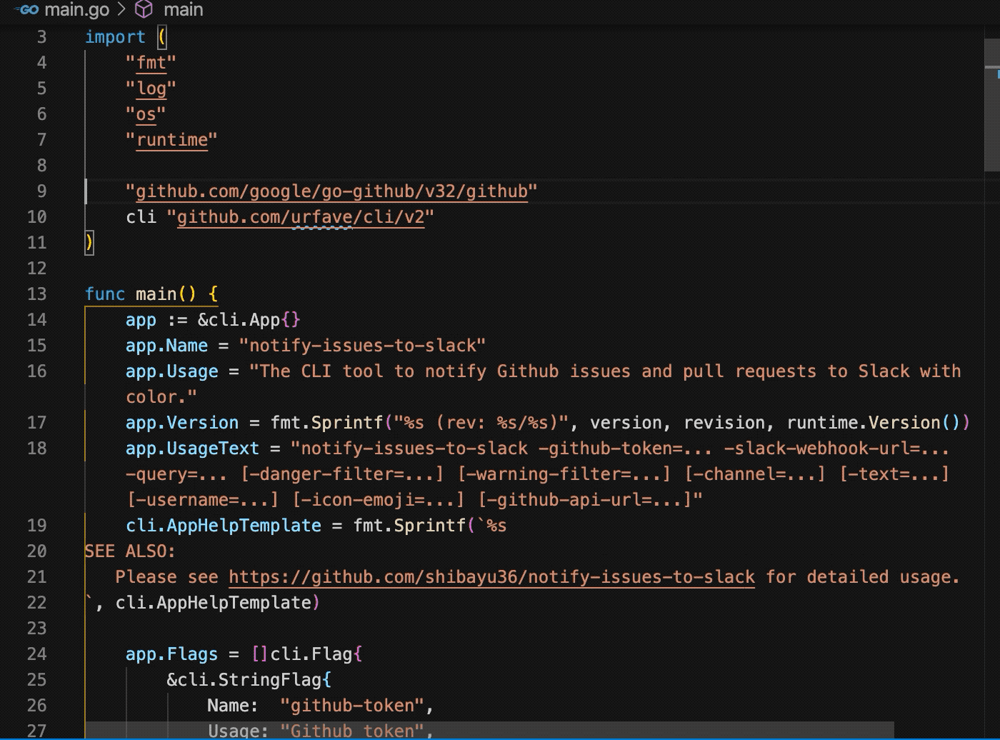

# Search in Current File

This is a Visual Studio Code extension that makes it easily to search in current active editor.  It is inspired by the emacs extension helm-occur.



## Commands
### Search in Current File
Search only in current file displayed in the active editor.  Automatically, the currently selected text is filled into the search query, and the current file is filled into "files to include" in the Search Panel.

## Useful Keyboard Shortcuts Example
```json
// Only type ctrl+o when using Find.
// the query in Find is filled into the query in Search.
{
  "key": "ctrl+o",
  "command": "search-in-current-file.searchInCurrentFile",
  "when": "editorFocus && findInputFocussed"
},
{
  "key": "ctrl+cmd+o",
  "command": "search-in-current-file.searchInCurrentFile",
  "when": "editorFocus"
}
```

## Attribution
Icons made by <a href="https://www.flaticon.com/authors/smashicons" title="Smashicons">Smashicons</a> from <a href="https://www.flaticon.com/" title="Flaticon"> www.flaticon.com</a>
